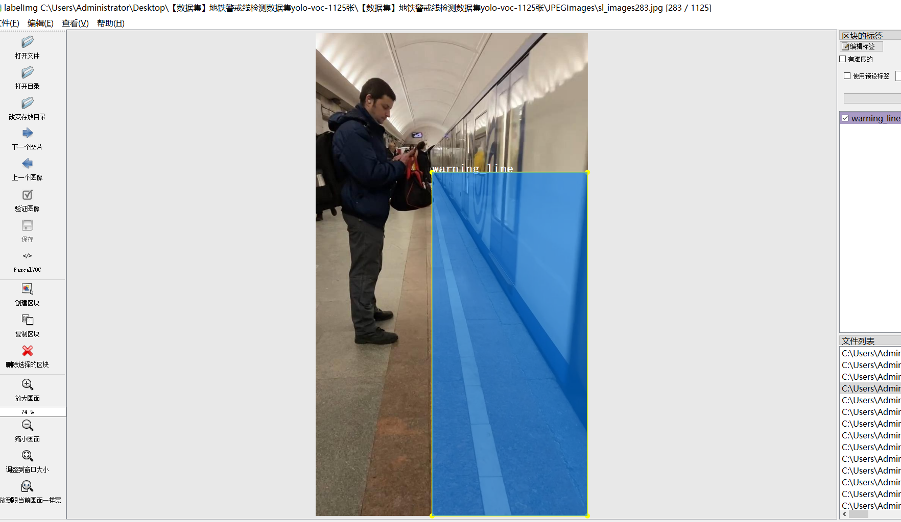
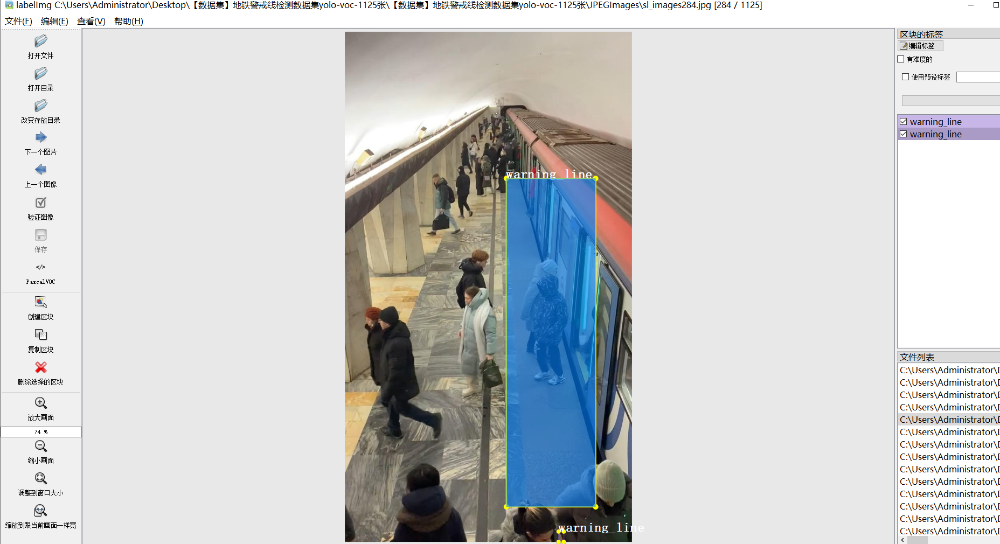
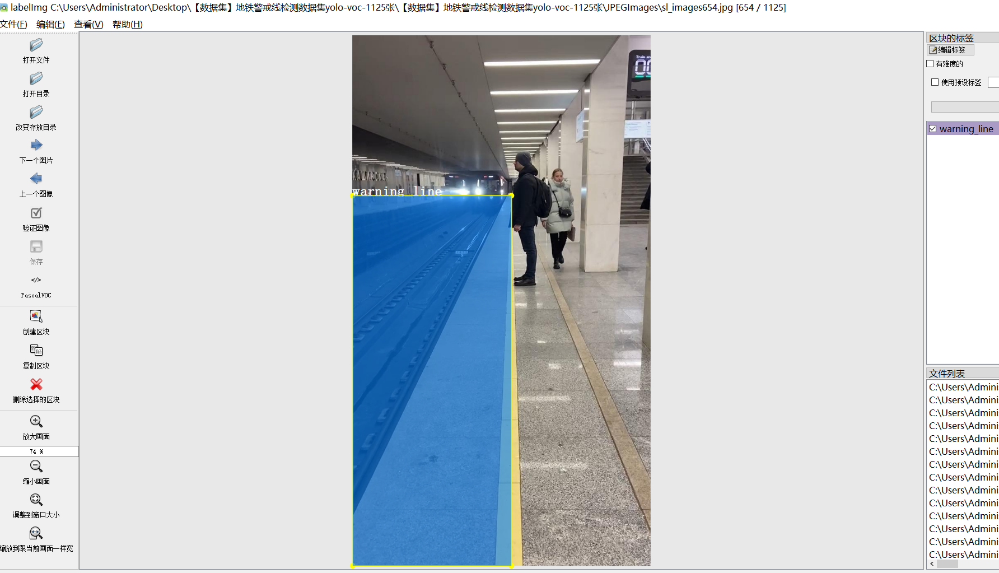
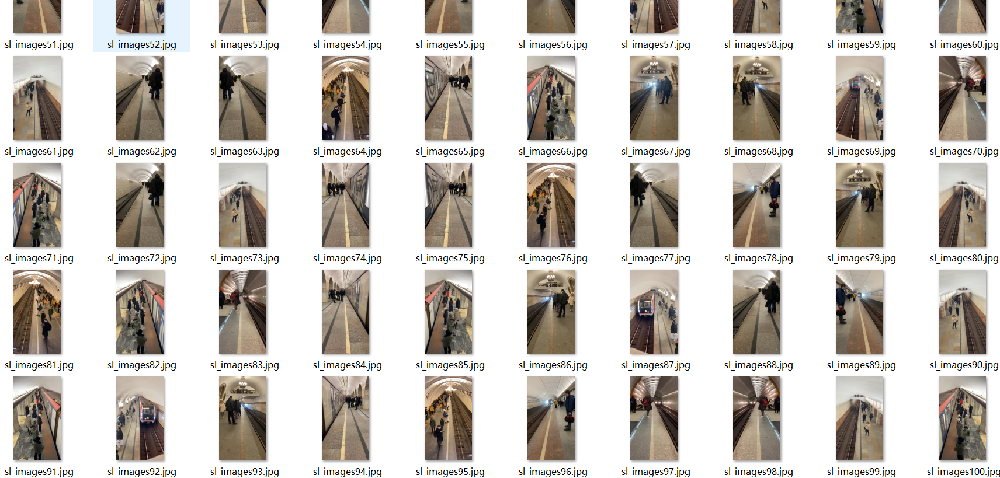

# [Dataset] Subway Warning Line Detection Dataset YOLO-VOC 1125 images

Dataset Format: VOC format + YOLO format

The compressed file contains: three folders, each storing images, xml files, and text files.

The total number of jpg images in the JPEGImages folder is 1125.

The total number of xml files in the Annotations folder is 1125.

The total number of txt files in the labels folder is 1125.

Number of tag types: 1

Tag Name: ["warning_line"]

Number of boxes per label:

The number of warning lines is 1635.

Total number of frames: 1635

Picture clarity (Resolution: Pixels): Clear

Is the image enhanced: No

Shape of the label: Rectangular box, used for object detection and recognition.

Important Note: None

Special Notice: This dataset does not guarantee the accuracy or precision of the trained models or weight files. The dataset only provides accurate and reasonable annotations.

## Images

---

Here is a pay link on Stripe (https://buy.stripe.com/3cs8yP7sY87d0vu9AB). Please contact me lonlonago@foxmail.com after funding $89, and I will send you a complete data files, thank you!

